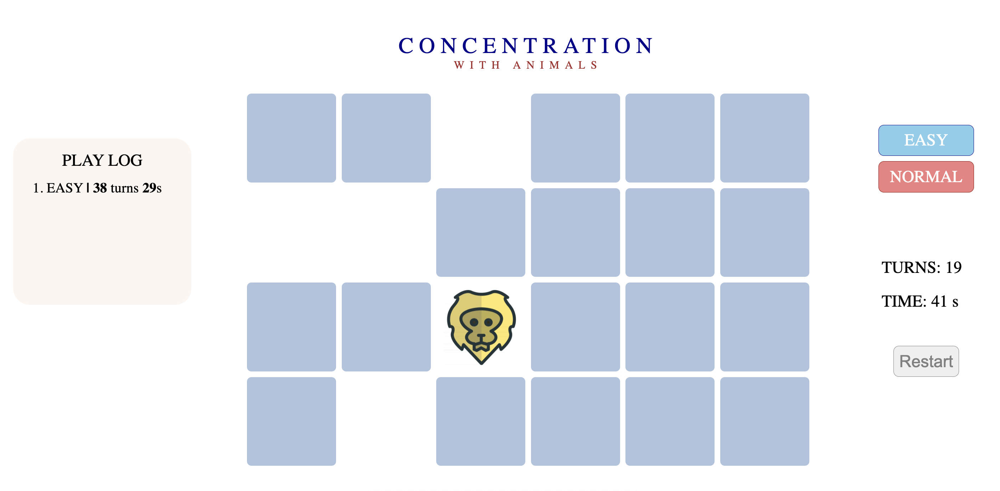

# Concentration

### What is Concentration and how to [play](https://yongheekim0.github.io/concentration/)?

[Concentration](<https://en.wikipedia.org/wiki/Concentration_(card_game)>) is a round game in which all of the cards are laid face down on a surface and two cards are flipped face up over each turn. The object of the game is to turn over pairs of matching cards.

### What does it look like?

### What's spacial?

- Play with up to 12 animals
- Choose difficulty
- Play log: who played better?

### Getting started

1. Choose Easy or Normal
2. Find the pair by clicking them
3. You can restart if you want

### Next steps

- New play mode: show the shuffled cards for a second when stared and speedrun
- Add options for diffrent kinds of cardsets

### Technologies used

- HTML/CSS/Javascript
- Potential bugs fixed
  - Prevent event listener from functioning when clicked
  - switch mode and restart seamlessly
